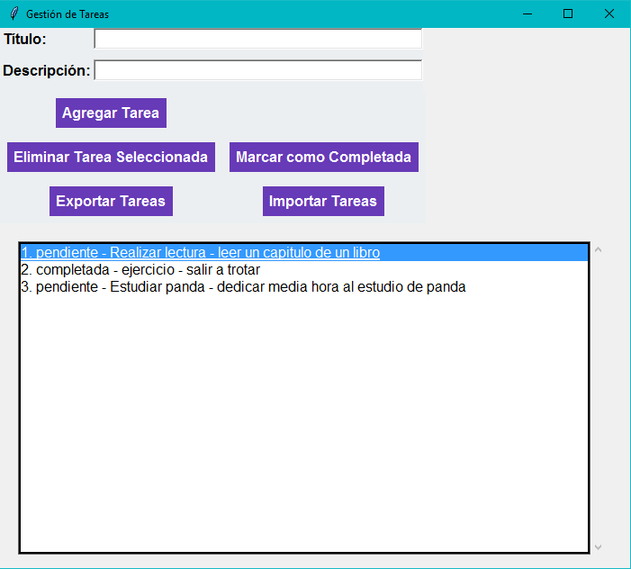

# Gestor de Tareas

Este proyecto permite gestionar tareas mediante una interfaz gráfica de usuario con `Tkinter` y una base de datos SQL.

## Estructura del proyecto

- `app.py`: Archivo principal.
- `database/`: Configuración de la base de datos y modelo.
- `services/`: Lógica de negocio para tareas.
- `ui/`: Interfaz gráfica.

## Requisitos

- Python 3.x 
- pip
- SQLAlchemy (pip install sqlalchemy)
- Tkinter (interfaz gráfica)
-dotoenv (pip install python-dotenv)
-pymysql (pip install pymysql)
- cryptography (pip install cryptography)

## Instalación

1. Clona el repositorio.
3. Ejecuta `app.py`.

## Uso

1. Agrega tareas.
2. Marca como completadas.
3. Elimina tareas seleccionadas.
4. Guarda o carga tareas desde `tasks.json`.

## Sonarqube